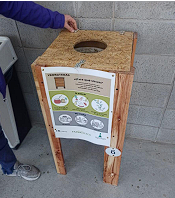
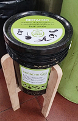
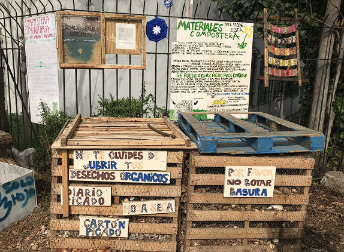
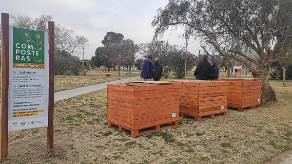
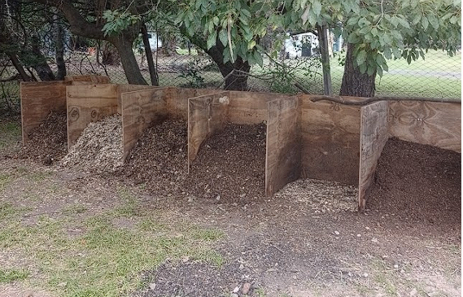
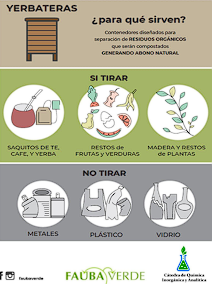

# Protocolo para el Tratamiento de Residuos Orgánicos en la Universidad de Buenos Aires

**PROGRAMA UBA VERDE - SECRETARÍA DE EXTENSIÓN UNIVERSITARIA**

En el siguiente documento se desarrollarán los pasos de análisis para llevar a cabo la planificación de un sistema eficiente de separación, recolección y tratamiento de los residuos orgánicos generados en las instituciones y edificios pertenecientes a la Universidad de Buenos Aires.

## Residuos Generados

Para comenzar se invita a realizar un sondeo de los residuos orgánicos generados a simple vista por quienes conforman la institución (estudiantes, docentes y no docentes).

**Ejemplo:**

| Roles       | Residuos                             |
| ----------- | ------------------------------------ |
| Estudiantes | Yerba                                |
| Docentes    | Yerba y cáscaras de fruta            |
| No Docentes | Yerba, cáscaras de frutas y verduras |

A continuación, se invita a realizar la misma tabla, incluyendo particularidades de la institución, tales como comedores, generación de bosta de animales herbívoros, etc.

**Ejemplo:**

| Espacio              | Residuo generado            | Tratamiento actual      |
| -------------------- | --------------------------- | ----------------------- |
| Comedor              | Restos de frutas y verduras | Ninguno, va a la basura |
| Recintos de animales | Bostas de herbívoros        | Queda en el recinto     |

Una vez definidos los residuos de cada actor y espacio, se procede a hacer un análisis del espacio donde puede ser recolectado, y luego compostado.

## Recipientes de recolección

Experiencias en edificios de nuestra universidad nos demuestran que la colocación de “biotachos” con tapa o dentro de estructuras denominadas “yerbateras” cumplen debidamente su función de recolección del residuo generado in situ en las cercanías de aulas y oficinas.

- **Ejemplo**:

| “Yerbateras” en FAUBA                                        | Biotachos en EXACTAS.                                         |
| ------------------------------------------------------------ | ------------------------------------------------------------- |
|  |  |

Una vez definido el sistema de contenedores de recolección, se deberá analizar los puntos claves para su instalación, como pasillos más recorridos, edificios centrales, etc. Esto puede hacerse progresivamente. Comenzar con 3 lugares, avanzar luego con 5, y así sucesivamente.

Estos tachos deberán ser recolectados un mínimo de 2 veces por semana para evitar olores y visitas de bichos. Por lo cual debemos abordar quienes serán lxs encargadxs de esta tarea. Contamos con la experiencia de realización tanto por parte de personal de campo / maestranza, como de voluntarios.

Será importante tener en cuenta los recursos intraprediales y externos que serán necesarios para llevar adelante la gestión.

### Yerbateras

Para las yerbateras serán necesarios:

- Tachos de 20 litros (contar con al menos dos por yerbatera a instalar, de modo de poder realizar el recambio)
- Pallets o descartes de maderas
- Bisagras metálicas o tiras de tela tipo persiana que cumplen la misma función
- Clavos

### Biotachos

Para los biotachos:

- Tachos de 10 o 20 litros CON TAPA e identificación
- Base de madera (opcional)
- Sector de compostado

En cuanto al compostario, será necesario proponer un espacio viable, tanto para la instalación de una compostera a tierra, como una cerrada en espacio de cemento según la disponibilidad del edificio en cuestión.

Ejemplo con pallets y alambrado (a tierra)

Ejemplo con pallets o maderas (sobre tierra o cemento)

Ejemplo directo a tierra (experiencia FCEN)

## Recursos a disponer (según el modelo elegido):

- Maderas
- Pallets
- Alambrado
- Espacio a tierra o cemento

### Personal de Recolección y Logística

En cuanto a la recolección, recomendamos realizar un trabajo previo con personal de campo o maestranza, que más allá de la ayuda o colaboración voluntaria que pueda trabajar en conjunto, serán actores fundamentales para la ejecución de la recolección y transporte de los tachos con orgánicos hacia el sector de compostado. En algunas experiencias con las que contamos, actores voluntarios realizan el vaciado y lavado de estos tachos para dejarlos a disposición del personal para su recambio en la siguiente recolección.

### Educación Ambiental, Difusión y Cartelería

Toda la comunidad educativa forma parte de esta gestión como generadores del residuo a tratar. Es por lo tanto que la comunicación y concientización sobre la nueva implementación y su impacto positivo a nivel ambiental son factores fundamentales para contar con su participación y correcta separación.

Ejemplo de cartelería utilizada en FAUBA.

### ¿Qué hacemos con el compost?

Una vez maduro nuestro compost contaremos con un nuevo recurso de gran valor y de tratamiento intrapredial que podrá ser utilizado dentro del marco académico para proyectos de análisis químicos, como luego también incorporado como fertilizante de origen natural a canteros y espacios verdes de nuestro predio, como también ofrecido a la comunidad educativa.

### ¿Quieres saber más sobre el compost, su realización y sus propiedades?

Desde UBA Verde ofrecemos un acompañamiento para la implementación de este protocolo de instalación dirigido a quienes integren el programa de gestión de residuos de tu edificio, como también una capacitación especial sobre residuos orgánicos para toda la comunidad educativa que vaya a participar de la separación.

**Separados son un recurso,  
juntos son basura...**

¡Gracias por sumarte a UBA Verde!
